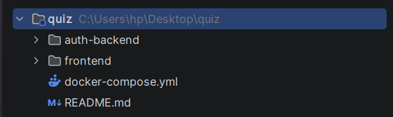
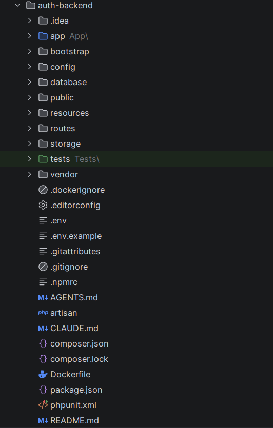
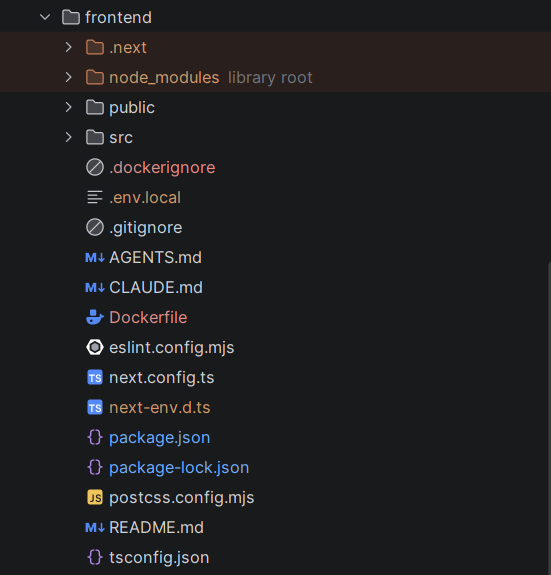
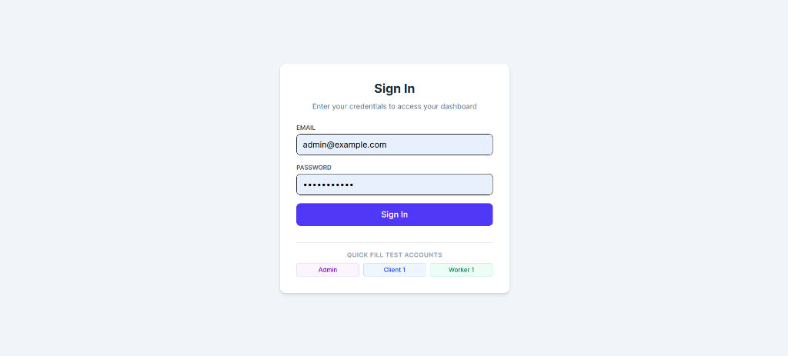
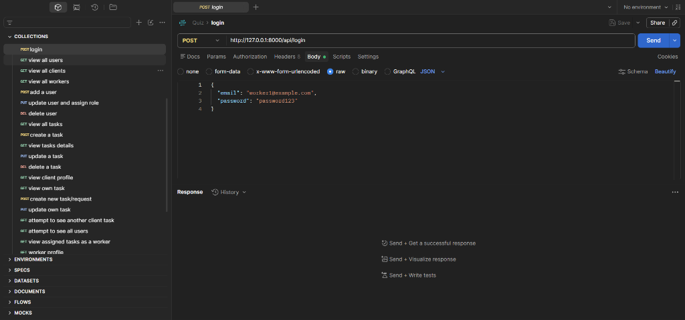

#  TaskFlow RBAC - Multi-Role Task & Work Order Management System

TaskFlow is a full-stack, multi-tenant Role-Based Access Control (RBAC) application. It facilitates end-to-end task and work-order delegation across three distinct system roles: **Admin**, **Client**, and **Worker**.

---

##  Table of Contents
1. [Project Overview](#-project-overview)
2. [Technologies Used](#-technologies-used)
3. [System Architecture](#-system-architecture)
4. [Project Structure](#-project-structure)
5. [Authentication & Authorization Design](#-authentication--authorization-design)
6. [Environment Configuration](#-environment-configuration)
7. [Installation & Setup (Local Bare-Metal)](#-installation--setup-local-bare-metal)
8. [Docker Setup & Deployment](#-docker-setup--deployment)
9. [Database Migrations & Seeders](#-database-migrations--seeders)
10. [Test User Accounts](#-test-user-accounts)
11. [Running Automated Tests](#-running-automated-tests)
12. [Project Progress: Completed vs Remaining](#-project-progress-completed-vs-remaining)
13. [Screenshots & API Documentation](#-screenshots--api-documentation)

---

##  Project Overview

The system establishes strict data boundary isolation between actors:
* **Admin**: Oversees global user accounts, creates/assigns tasks to workers, modifies assignments, and monitors all workflow states.
* **Client**: Submits service requests/tasks, edits own pending requirements, and tracks worker progress in real time.
* **Worker**: Views personal assigned task queue and updates fulfillment states (`pending` ➔ `in_progress` ➔ `completed`).

---

##  Technologies Used

### Backend
* **Language & Framework**: PHP 8.2 / Laravel 11+
* **Authentication**: Laravel Sanctum (Stateful Bearer Token API)
* **Database**: PostgreSQL 16 (or SQLite / MySQL compatible)
* **Access Control**: Laravel Policies, Custom Role Middleware, Gate guards

### Frontend
* **Framework**: Next.js 14+ (App Router, React 18, TypeScript)
* **State & API**: React Context API (`AuthContext`), Axios HTTP client with request interceptors
* **Styling**: Tailwind CSS, Lucide React icons

### DevOps & Containerization
* Docker & Docker Compose (Multi-stage container builds for PHP-FPM, Node.js Alpine, and PostgreSQL)

---

##  Architecture

The platform operates on a decoupled client-server model:

```text
┌─────────────────────────────────────────────────────────────┐
│                    Next.js Frontend (SPA)                   │
│         (Client-Side Auth Context & Role Route Guards)       │
└──────────────────────────────┬──────────────────────────────┘
                               │ JSON / REST API (Bearer Token)
                               ▼
┌─────────────────────────────────────────────────────────────┐
│                 Laravel Sanctum API Gateway                 │
│    [CheckRole Middleware] ───► [Controller] ───► [Policies] │
└──────────────────────────────┬──────────────────────────────┘
                               │
                               ▼
┌─────────────────────────────────────────────────────────────┐
│                 PostgreSQL Database (Engine)                │
│             [users table] ◄───► [tasks table]               │
└─────────────────────────────────────────────────────────────┘
```

---

##  Project Structure

```text
quiz/
├── auth-backend/               # Laravel API Application
│   ├── app/
│   │   ├── Http/
│   │   │   ├── Controllers/    # AuthController, TaskController, UserController
│   │   │   └── Middleware/     # CheckRole.php
│   │   ├── Models/             # User.php, Task.php
│   │   └── Policies/           # TaskPolicy.php, UserPolicy.php
│   ├── database/
│   │   ├── migrations/         # Users, Tasks, and Token tables
│   │   └── seeders/            # DatabaseSeeder.php with test matrix
│   ├── routes/
│   │   └── api.php             # Protected RBAC route endpoints
│   └── Dockerfile
│
├── frontend/                   # Next.js Frontend Application
│   ├── src/
│   │   ├── app/
│   │   │   ├── admin/          # Admin CRUD & Task Matrix Console
│   │   │   ├── client/         # Client Submission & Edit View
│   │   │   ├── worker/         # Worker Work-Order Queue View
│   │   │   ├── login/          # Token Authentication Form
│   │   │   └── layout.tsx      # AuthProvider Root Wrapper
│   │   ├── context/            # AuthContext.tsx (Global session state)
│   │   └── lib/                # api.ts (Axios Bearer Interceptor)
│   └── Dockerfile
│
├── docker-compose.yml          # Multi-container orchestration
└── README.md
```

---

##  Authentication & Authorization Design

### 1. Authentication Approach (Laravel Sanctum Tokens)
**Why this approach?**
Sanctum was chosen because it provides a lightweight, token-based authentication mechanism optimized for Single Page Applications (SPAs) and mobile/external clients without the overhead of OAuth2 servers (e.g., Laravel Passport).
Issued tokens are cryptographically hashed and stored in database records (`personal_access_tokens`), allowing rapid token revocation on logout.

### 2. Authorization Design (Multi-Tier Defense)
The system employs a two-layer security model:
* **Vertical Authorization (Role Middleware)**: Guarded via `CheckRole` middleware (`role:admin`, etc.) on route declarations to block unauthorized tiers before reaching controllers.
* **Horizontal Authorization (Laravel Resource Policies)**: `TaskPolicy` checks object-level ownership:
    * Clients can only inspect and edit tasks where `task.client_id === auth.id`.
    * Workers can only update the status of tasks where `task.worker_id === auth.id`.
    * Admins bypass ownership checks (before hook) to manage all records.

---

##  Environment Configuration

### Backend (`auth-backend/.env`)
```env
APP_NAME=TaskFlowAuth
APP_ENV=local
APP_KEY=base64:YOUR_GENERATED_APP_KEY=
APP_DEBUG=true
APP_URL=http://localhost:8000

DB_CONNECTION=pgsql
DB_HOST=127.0.0.1
DB_PORT=5432
DB_DATABASE=auth_quiz_db
DB_USERNAME=postgres
DB_PASSWORD=password123

SANCTUM_STATEFUL_DOMAINS=localhost:3000,127.0.0.1:3000
```

### Frontend (`frontend/.env.local`)
```env
NEXT_PUBLIC_API_URL=http://127.0.0.1:8000/api
```

---

##  Installation & Setup (Local Bare-Metal)

### 1. Backend Setup
```powershell
cd auth-backend
composer install
cp .env.example .env
php artisan key:generate
php artisan migrate --seed
php artisan serve --port=8000
```

### 2. Frontend Setup
```powershell
cd frontend
npm install
npm run dev
```

---

##  Docker Setup & Deployment

To launch the full stack (PostgreSQL + Laravel API + Next.js App) with a single command:

```powershell
# From the project root (where docker-compose.yml is located)
docker compose up --build -d
```

* **Frontend UI**: http://localhost:3000
* **Backend API**: http://localhost:8000/api
* **Postgres Database**: localhost:5432

To tear down containers and wipe persistent database volumes:
```powershell
docker compose down -v
```

---

##  Database Migrations & Seeders

Run Migrations manually:
```powershell
php artisan migrate:fresh --seed
```

Or inside Docker:
```powershell
docker compose exec backend php artisan migrate:fresh --seed
```

---

##  Test User Accounts

| Role | Email | Password | Allowed Access |
|---|---|---|---|
| Admin | `admin@example.com` | `password123` | Full Access: User CRUD, Task Assignment & Deletion |
| Client | `client1@example.com` | `password123` | Client Dashboard: Task Request Creation & Content Edit |
| Worker | `worker1@example.com` | `password123` | Worker Queue: View Assigned Tasks & Update Status |

---

## Running Automated Tests

To execute automated backend tests (Unit & Feature tests for role authorization and API responses):

```powershell
# Bare-metal
php artisan test

# Inside Docker Container
docker compose exec backend php artisan test
```

---

##  Project Progress: Completed vs Remaining

###  What is Completed:
- [x] Sanctum-based API Token Authentication (`/login`, `/logout`, `/me`).
- [x] Role-Based Route Middleware (`CheckRole`) and Model Policies (`TaskPolicy`).
- [x] Complete RESTful API for Users (`UserController`) and Tasks (`TaskController`).
- [x] Next.js App Router Frontend with global state management via `AuthContext`.
- [x] Role-specific dashboards (Admin matrix, Client workspace, Worker queue).
- [x] Modals for editing users, reassignment, and modifying task details.
- [x] Full Docker Compose multi-container environment with PostgreSQL.

###  What Remains (Backlog / Future Enhancements):
- [ ] Dedicated User Profile settings page (Profile editing / password update for individual accounts).
- [ ] Unit and Feature test suites (`tests/Feature/AuthTest.php`, `TaskPolicyTest.php`).


---

##  Screenshots & API Documentation

### 1. Project Directory Structure
**Project Directory**


**Backend Structure**


**Frontend Structure**


### 2. Frontend Dashboards
**Login Screen**


**Admin Dashboard**
*(Replace with screenshot of the Admin users & tasks management page)*

**Client Workspace**
*(Replace with screenshot of Client task creation and list view)*

**Worker Order Queue**
*(Replace with screenshot of Worker queue with status dropdowns)*

### 3. Postman API Testing & Collection
**Sanctum Login Request**


**Protected Task API Response**
*(Insert Postman screenshot here)*
# fullstack-rbac-quiz

